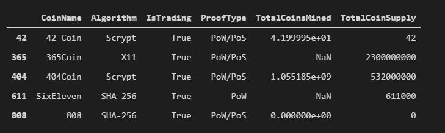
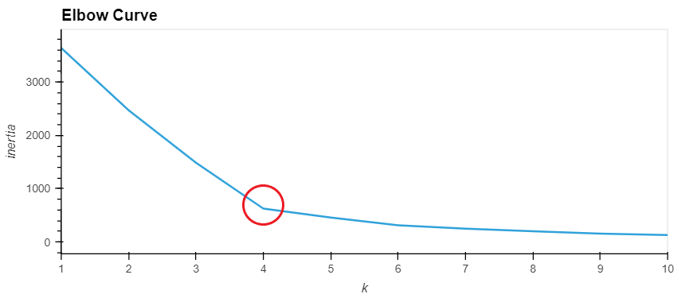
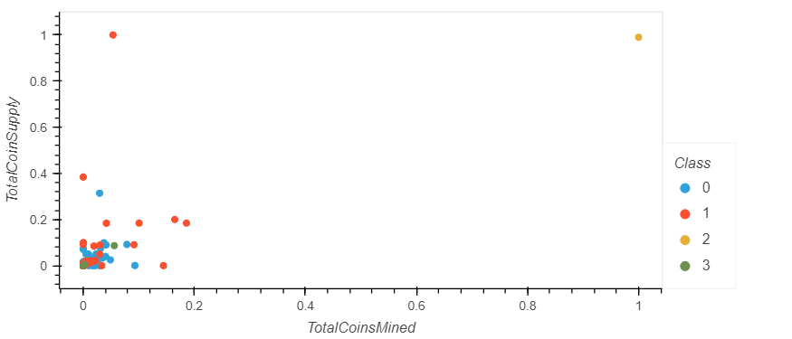

# Cryptocurrencies Market Analysis

The purpose of this analysis was to analyze the cryptocurrency market and determine... 

(1) which crypto currencies are actively traded, and 

(2) how can the currencies in the market be classified for potential investment purposes. For example, should coins be grouped by total coins mined, total supply, type of algorithm used to create the coin, or proof type (i.e. proof of scale versus proof of work)

The original dataset included 1,252 cryptocurrencies with 5 high level metrics for each coin. 

The analysis focused only on surviving tradeable coins and therefore the original dataset was reduced by filtering out coins which were not currently trading or had not actively been mined. The resulting dataset included 532 cryptocurrencies.

The features in the dataset were then reduced using principal component analysis (PCA) to determine the three best features to use for clustering the dataset. The three features which were selected by the PCA algorithm were then used as the input for a K-means clustering algorithm. 

The K-means algorithm was tested with a range of cluster inputs to create an elbow curve which helps better understand the number of clusters we could create which would help maximize the usefulness of the data output. 

As shown in the elbow curve image, we are looking for the spot on the curve where the slope begins to shift towards flat. Four clusters were chosen to create a model and fit our dataset with cluster predictions. 

The model predictions were then added to our dataset and PCA components were graphed in a 3D-scatter plot to visualize the relationships between the clusters. 

The plot shows two well defined classes and two classes which are made up primarily of outliers. 

The classified dataset was further analyzed by limiting the features analysis to only total coins mined and total coin supply. 

The resulting 2D scatter plot shows a tight grouping of smaller market cap coins with a few significant outliers. 

This visualization shows how adding additional features can help with grouping a dataset into unique clusters. The 2d plot makes it difficult to see how many of the coins differ because of the tight grouping near the lower end of both total coins mined and total coin supply. As shown in the 3d plot above, adding additional features can provide a better means of classifying tradeable cryptocurrencies. 

